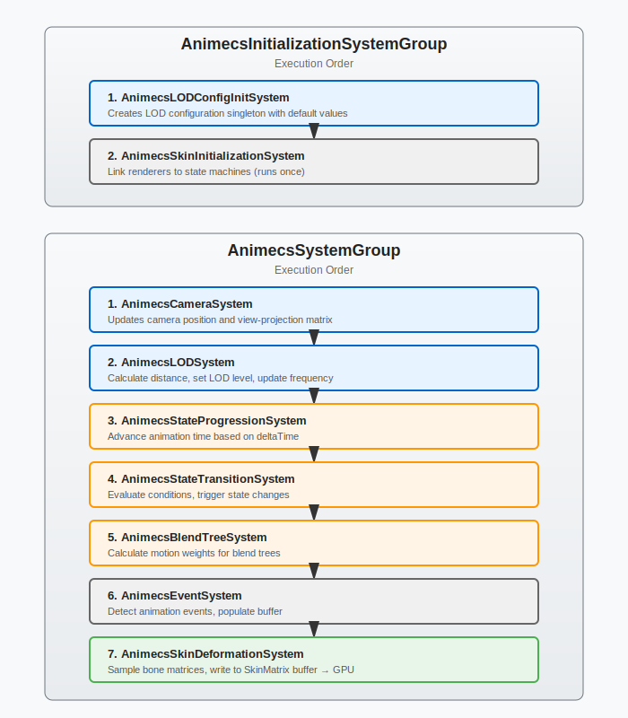

# Architecture

Animecs operates in two phases: **authoring** (baking in editor) and **runtime** (ECS execution). Understanding this separation is key to understanding performance.

## System Flow


Authoring converts Animator Controllers to blob assets. Runtime systems read these blobs and update entity components. Unity Entities Graphics handles rendering.

## Authoring Components

Authoring components are MonoBehaviours that exist only during baking. They convert Unity data to ECS-compatible structures.

| Component | Location | Purpose |
|-----------|----------|---------|
| `AnimecsStateMachineBaker` | Prefab root | Converts Animator Controller to state machine blob |
| `AnimecsSkinMatrixBaker` | Each SkinnedMeshRenderer | Bakes bone matrix data for skeleton |
| `AnimecsBlendShapeBaker` | SkinnedMeshRenderers with blend shapes | Bakes blend shape weight data |
| `AnimecsDebuggerAuthoring` | Prefab root (optional) | Enables debug visualization |

### Baked Data

**State Machine Blob:**
- States (name, speed, cycle offset, blend tree, transitions, events)
- Parameters (type, default values)
- Transitions (conditions, duration, exit time)

**Bone Matrix Blob:**
- Pre-sampled bone transforms for all animation frames
- Organized by clip index for fast lookup
- Shared across entities with identical skeletons

**Blend Shape Blob:**
- Pre-sampled blend shape weights for all frames
- Only created if mesh has blend shapes

## Entity Structure


Runtime entities follow a parent-child structure matching the authoring prefab.

### Root Entity (State Machine)

| Component | Purpose |
|-----------|---------|
| `AnimecsTag` | Identifies state machine entities |
| `AnimecsStateData` | Current state, time, blend progress |
| `AnimecsStateMachineBlob` | Reference to baked state machine |
| `AnimecsParameters` | Reference to parameter blob |
| `AnimecsLOD` | LOD level and update frequency |
| `AnimecsFloatParameter` (buffer) | Per-entity float parameter values |
| `AnimecsIntParameter` (buffer) | Per-entity int parameter values |
| `AnimecsBoolParameter` (buffer) | Per-entity bool parameter values |
| `AnimecsTriggerParameter` (buffer) | Per-entity trigger parameter values |

### Child Entities (Renderers)

| Component | Purpose |
|-----------|---------|
| `AnimecsSkinMatrixTag` | Identifies renderer entities |
| `AnimecsBoneMatrix` | Reference to shared bone blob |
| `AnimecsStateMachineParent` | Link to root entity |
| `SkinMatrix` (buffer) | Computed bone transforms (GPU-bound) |
| `BlendShapeWeight` (buffer) | Computed blend shape values |

## Systems

Animecs uses two system groups:

- **AnimecsInitializationSystemGroup** executes in `InitializationSystemGroup` for one-time setup
- **AnimecsSystemGroup** executes late in `SimulationSystemGroup` for per-frame animation updates



### Execution Order

#### AnimecsInitializationSystemGroup

| System | Purpose |
|--------|---------|
| **AnimecsLODConfigInitSystem** | Creates LOD configuration singleton with default values |
| **AnimecsSkinInitializationSystem** | Links renderer entities to state machine roots |

#### AnimecsSystemGroup

| System | Purpose |
|--------|---------|
| **AnimecsCameraSystem** | Updates camera position and view-projection matrix |
| **AnimecsLODSystem** | Calculates distance to camera, sets LOD level and update frequency |
| **AnimecsStateProgressionSystem** | Advances animation time based on deltaTime and state speed |
| **AnimecsStateTransitionSystem** | Evaluates transition conditions, initiates state changes |
| **AnimecsBlendTreeSystem** | Calculates motion weights for blend trees |
| **AnimecsEventSystem** | Detects animation event crossings, populates event buffer |
| **AnimecsSkinDeformationSystem** | Samples bone matrices, handles blending, writes to SkinMatrix buffer |
| **AnimecsBlendShapeSystem** | Samples blend shape weights, writes to BlendShapeWeight buffer |

### LOD Behavior

| LOD Level | Distance Threshold | Update Frequency |
|-----------|-------------------|------------------|
| High | 0-15m | Every frame |
| Medium | 15-40m | Every 2 frames |
| Low | 40-100m | Every 8 frames |
| Off | >100m | No updates |

Updates are temporally distributed using entity index to prevent frame spikes.

## Data Flow

Single frame execution for one entity:

```
1. LOD System
   └─ Distance = 25m → LOD Medium → Update every 2 frames
      └─ Frame counter check: Skip if not our frame

2. State Progression (if LOD allows)
   └─ CurrentStateTime += deltaTime * speed

3. Transition System (if LOD allows)
   └─ Evaluate conditions → Trigger transition if met

4. Blend Tree System (if state uses blend tree)
   └─ Read parameters → Calculate motion weights

5. Event System (if entity has events)
   └─ Compare current frame vs previous → Fire events if crossed

6. Deformation System
   └─ Sample bone matrices from blob[currentFrame]
   └─ Blend between states (if transitioning)
   └─ Blend between motions (if blend tree active)
   └─ Write to SkinMatrix buffer

7. Blend Shape System (if mesh has blend shapes)
   └─ Sample weights from blob[currentFrame]
   └─ Write to BlendShapeWeight buffer

8. Unity Entities Graphics
   └─ Read SkinMatrix buffer
   └─ Dispatch compute shader
   └─ Deform mesh on GPU
```

## Blob Asset Structure

### AnimecsStateMachineBlobAsset

```
States[]
  ├─ StateName
  ├─ Speed
  ├─ CycleOffset
  ├─ Motion (blend tree data)
  ├─ Transitions[]
  └─ Events[]
AnyStateTransitions[]
```

### AnimecsBoneBlobAsset

```
SkinMatrices[]               // Flat array: [clip0_frame0_bones...][clip0_frame1_bones...][clip1_frame0_bones...]
ClipMatrixStartIndices[]     // Index where each clip starts
TotalFrameCount
```

**Access pattern:**  
`SkinMatrices[ClipStartIndex + (frame * boneCount) + boneIndex]`

### AnimecsBlendShapeBlobAsset

```
BlendShapeNames[]
BakedWeights[]               // Flat array: [clip0_frame0_shapes...][clip0_frame1_shapes...]
ClipWeightStartIndices[]
BlendShapeCount
```

## Bone Structure Sharing

Characters with identical skeletons share bone blobs:

```
Character A (Hash: 0x12345) ──┐
Character B (Hash: 0x12345) ──┼─→ Bone Blob Asset #0x12345
Character C (Hash: 0x12345) ──┘

Character D (Hash: 0x67890) ───→ Bone Blob Asset #0x67890
```

Hash calculated from:
- Bone count
- Bone hierarchy
- Bind poses
- Animation clip set

## Performance Characteristics

**Strengths:**
- Zero reflection or string lookups at runtime
- All systems Burst-compiled
- Blob assets shared across entities
- Temporal LOD distribution prevents spikes

**Costs:**
- Baking takes time for large animation libraries in the animator.
- Entities Graphics may affect if the world contains too many deformed meshes in a single GraphicsBuffer. 

## Extension Points

### Custom Systems

Insert into `AnimecsSystemGroup`:

```csharp
[UpdateInGroup(typeof(AnimecsSystemGroup))]
[UpdateAfter(typeof(AnimecsStateProgressionSystem))]
public partial struct CustomSystem : ISystem { }
```

### Custom State Logic

Replace or extend progression/transition systems by querying `AnimecsStateData`.

### IK Integration

Add IK system after `AnimecsSkinDeformationSystem`, modify `SkinMatrix` buffer before GPU dispatch.
